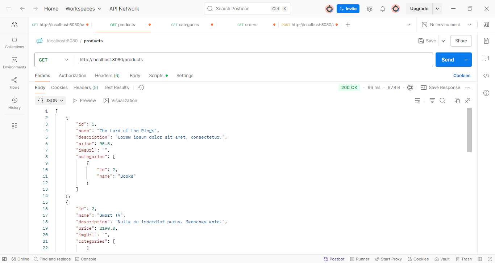
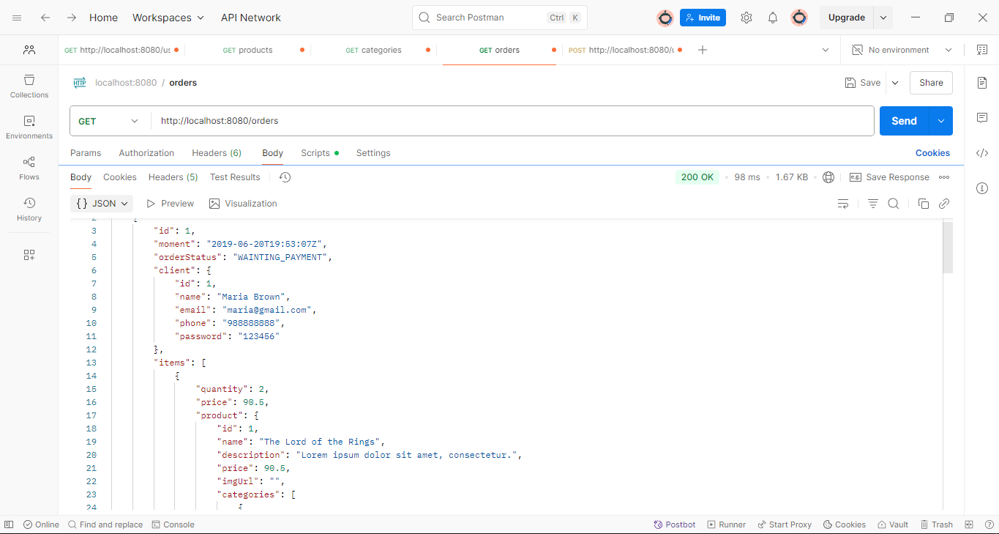
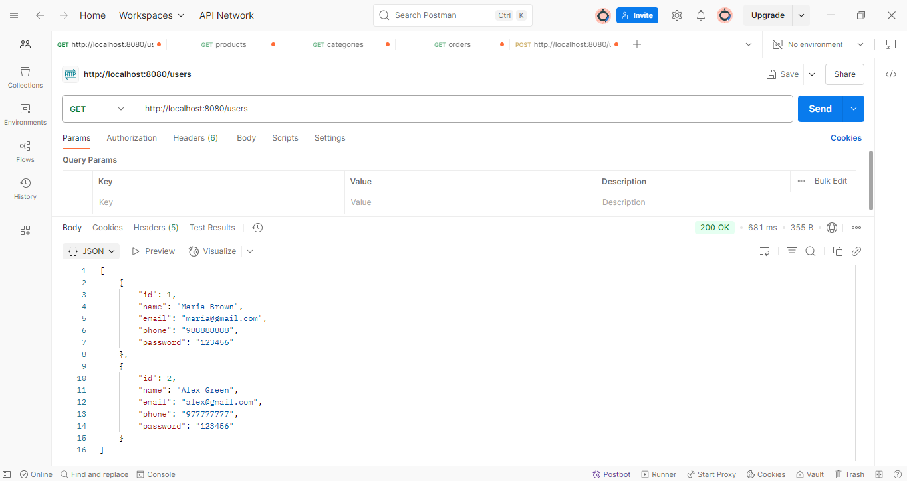
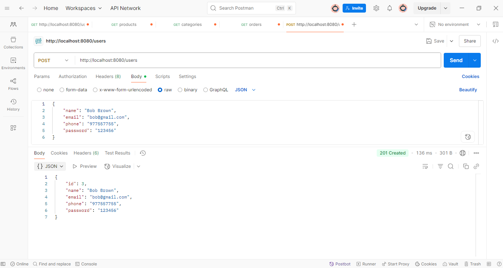

# Projeto Web Services com Spring Boot e JPA / Hibernate

Este projeto é o resultado final da seção bônus do curso [**Java COMPLETO Programação Orientada a Objetos + Projetos**](https://www.udemy.com/course/java-curso-completo/), ministrado por [Nélio Alves](https://github.com/acenelio).

Trata-se de uma **API RESTful** construída com **Spring Boot**, utilizando **JPA / Hibernate** como solução de persistência. O objetivo do projeto é consolidar os principais conceitos de modelagem de domínio, relacionamento entre entidades, acesso a dados com `JpaRepository` e a criação de serviços REST profissionais.


## Objetivo do Projeto

O objetivo é desenvolver um **sistema de pedidos de e-commerce**, com funcionalidades como:

- Cadastro de usuários, categorias e produtos
- Associação de pedidos a usuários e produtos
- Registro de pagamentos
- Uso de chaves compostas (`@EmbeddedId`)
- Enumerações (`@Enumerated`)
- Relacionamentos complexos (`@ManyToMany`, `@OneToMany`, `@OneToOne`)
- Controle de instâncias com injeção de dependência e serviços


## Tecnologias Utilizadas

- **Java 17**
- **Spring Boot**
- **Spring Data JPA**
- **Hibernate**
- **H2 Database** (em memória, para testes)
- **PostgreSQL** (produção)
- **Maven**
- **Postman** (para testes de endpoints)
- **IntelliJ IDEA** (IDE utilizada)


## Estrutura do Projeto

O projeto está organizado em camadas bem definidas, respeitando os princípios da arquitetura MVC e boas práticas com Spring Boot:

### 📁 Estrutura de Diretórios

```plaintext
src
└── main
    ├── java
    │   └── com
    │       └── educandoweb
    │           └── course
    │               ├── CourseApplication.java        # Classe principal com @SpringBootApplication
    │               ├── config
    │               │   └── TestConfig.java           # Classe para carga de dados de teste
    │               ├── entities
    │               │   ├── enums
    │               │   │   └── OrderStatus.java      # Enum representando status do pedido
    │               │   ├── pk
    │               │   │   └── OrderItemPK.java      # Classe auxiliar para chave composta
    │               │   ├── Category.java
    │               │   ├── Product.java
    │               │   ├── Order.java
    │               │   ├── OrderItem.java
    │               │   ├── Payment.java
    │               │   └── User.java
    │               ├── repositories
    │               │   ├── CategoryRepository.java
    │               │   ├── ProductRepository.java
    │               │   ├── OrderRepository.java
    │               │   ├── OrderItemRepository.java
    │               │   ├── PaymentRepository.java
    │               │   └── UserRepository.java
    │               ├── services
    │               │   ├── CategoryService.java
    │               │   ├── ProductService.java
    │               │   ├── OrderService.java
    │               │   ├── UserService.java
    │               │   └── exceptions
    │               │       ├── CategoryService.java
    │               │       ├── OrderService.java
    │               │       ├── ProductService.java
    │               │       └── UserService.java
    └── resources
        ├── application.properties                    # Configurações da aplicação
        ├── static/                                   # Conteúdo estático (se aplicável)
        └── templates/                                # Templates HTML (se aplicável)
```


## Exemplos Visuais

Algumas requisições de teste realizadas via Postman:

#### • Endpoint de Categorias (GET /categories)
Retorna todas as categorias cadastradas no sistema.


#### • Endpoint de Produtos (GET /products)
Lista todos os produtos disponíveis, com suas respectivas categorias.


#### • Endpoint de Pedidos (GET /orders)
Apresenta todos os pedidos realizados, com detalhes como status e data.


#### • Endpoint de Usuários (GET /users)
Retorna os usuários cadastrados, incluindo nome, e-mail e telefone.


#### • Criação de Usuário (POST /users)
Permite cadastrar um novo usuário no sistema enviando um corpo JSON com nome, e-mail, telefone e senha.



## Como Rodar o Projeto

1. **Pré-requisitos**:
    - Java 17
    - Maven
    - IntelliJ IDEA ou outra IDE compatível com Spring

2. **Clone o repositório**:
   ```bash
   git clone https://github.com/SabrinaGamaa/SpringBoot-JPA.git 
   ```

3. **Executar a aplicação:**:
    - Abra o projeto na IDE
    - Execute a classe CourseApplication
    - Acesse os endpoints via Postman ou navegador
---

## Observações Finais

Este projeto é uma demonstração prática de uma aplicação profissional com Spring Boot e JPA, aplicando padrões de projeto, arquitetura em camadas e boas práticas de desenvolvimento de APIs RESTful.

Sabrina Gama 

